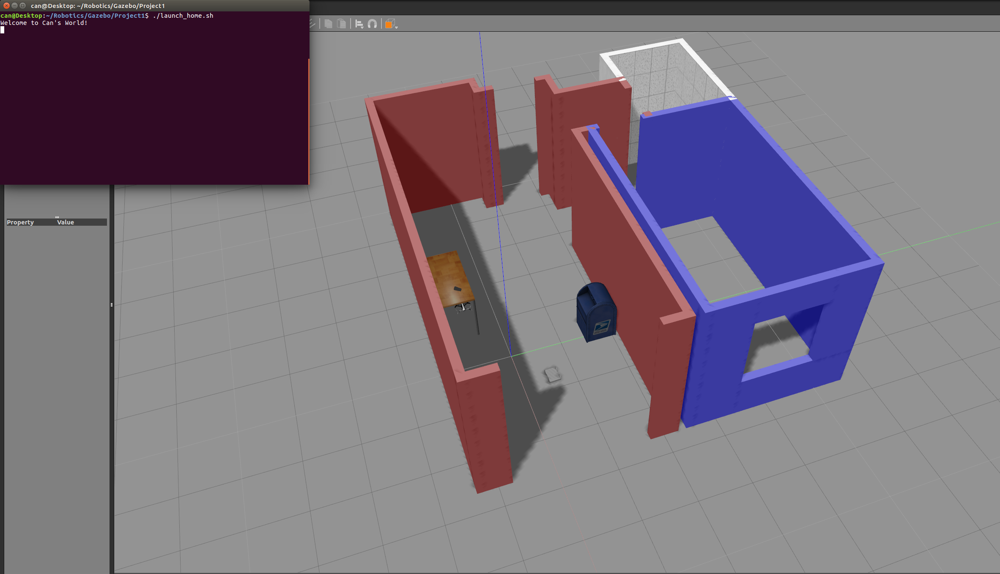

# gazebo_home_sim

This repo contains a simulation environment of a basic for of a home with a 4-wheeled mobile robot.
### Directory Structure
```
    .home_sim                          # Home simulation main folder 
    ├── images                         # Code output image 
    │   ├── output.png
    ├── model                          # Custom models
    │   ├── MobileRobot                # Model files of the 4-wheeled robot
    │   │   ├── model.config
    │   │   ├── model.sdf
    │   ├── Building                   # Building model
    │   │   ├── model.config
    │   │   ├── model.sdf
    ├── script                         # Gazebo World plugin C++ script
    │   ├── welcome.cpp
    ├── world
    │   ├── myworld
    ├── CMakeLists.txt                 # Link libraries 
    ├── launch_home.sh                 # Auto launch gazebo with environments
    └── 
```

### Steps to launch the simulation

#### Step 1 Update and upgrade the Workspace image
```sh
$ sudo apt-get update
$ sudo apt-get upgrade -y
```

#### Step 2 Clone the lab folder in /home/workspace/
```sh
$ cd /home/workspace/
$ git clone https://github.com/canersu/gazebo_home_sim.git
```

#### Step 3 Compile the code
```sh
$ cd /home/workspace/gazebo_home_sim/
$ mkdir build
$ cd build/
$ cmake ../
$ make
```

#### Step 4 Run launch file  
```sh
$ ./launch_home.sh
```

### Output
The welcome message and the 4-wheeled robot inside a Gazebo World should both launch as follow: 

